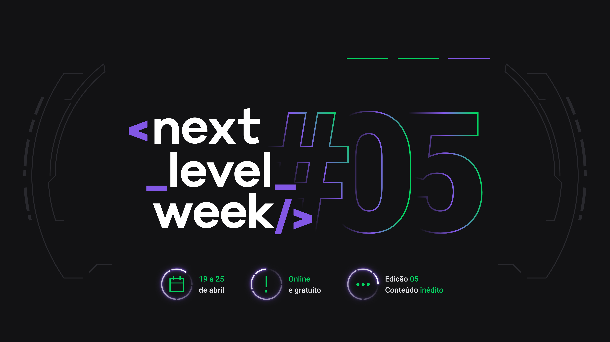
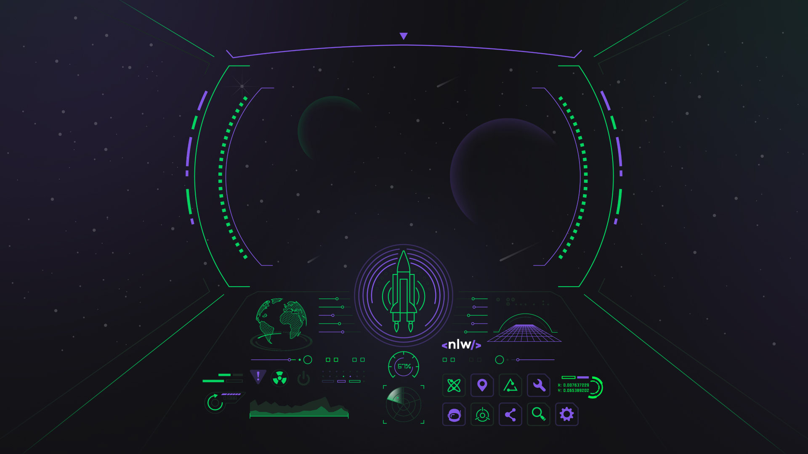

# Next Level Week 5 Rocketseat - ReactJs

A **Next Level Week** é um evento da **Rocketseat** de imersão em tecnologia. Onde é uma semana de aulas com conteúdos incríveis e uma comunidade bem massa de se fazer network. Nesse evento há diversas tecnologias, esta por exemplo é a trilha de **ReactJs**.

_#juntosparaoproximonivel_

## Proposta do projeto NLW5 ReactJs

A proposta deste projeto é desenvolver um app de podcast com as tecnologias `Next.js`, `ReactJs` e `Typescript`.

## Conteúdo

**Aula 1**

A primeira aula foi para apresentar as tecnologias `Next.js`, `React` e `Typescript`. Além de explicar sobre o projeto a ser desenvolvido e a respeito de componentes no `React` e sobre `Server-Side Rendering (SSR)` e `Static Site Generation (SSG)`.

**Aula 2**

A segunda aula foi de explicação de como utilizar o `Typescript` no `React` e também foi criado dois componentes, o _header_ e o _player_ que estará presente em boa parte das telas.

**Aula 3**

A terceira aula foi para a gente finalizar a tela principal (_index_), fazer a tela de _episode_, onde podemos ver informações sobre o episódio e fazer a rota da página _index_ para a página de _episode_.

**Aula 4**

A quarta e penúltima aula a gente aprendeu muita coisa, vimos sobre o `Context` no `React`, sobre as `Ref's` de um componente _HTML_ no `React` e além disso a gente concluiu a parte de controle de _play_ e _pause_ do podcast.

---

Agradecimento à **Rocketseat** 🚀 pelo evento incrível!💜

_Matheus Ishiyama_
